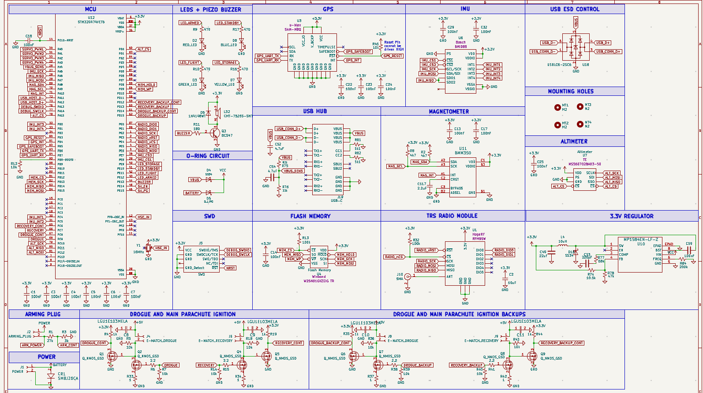

# High-Altitude Avionics Flight Sensor (AFS)

This documentation serves as the technical Design Specification for the AFS v3.0 platform. The AFS is a high-performance flight computer optimized for collecting meteorological telemetry and managing dual-stage recovery ignition for high-altitude vehicles.

### System Architecture
The board is centered around an **STM32G474VET6** MCU, chosen specifically for its high-resolution PWM for servo control and several SPI/I2C buses for per sensor load and isolation.

**Current Status:** WIP

---

## System Overview
The architecture follows a zone isolation design:

* **Power Zone:** High-current regulation and source arbitration.
* **Control Zone:** High-speed processing and logic.
* **Sensor Zone:** Low-noise analog and digital bus isolation.
* **Recovery Zone:** Isolated high-side power switching.

## Interesting Component: High-Side MOSFET Ignition Logic

* **Design Justification** Standard low-side switching is common, but in a high power rocketry environment with carbon-fiber and metallic component, leaving pyrotechnics electrically hot provides unintentional paths to ground through the rocket's chassis. High-switching alternatively ensures that the e-match remains at 0v potentional during standby, preventing any accidental ground from triggering early recovery deploymen during assembly pre-flight. 
* **Operating Principle:** This design utilizes a two stage MOSFET driver where an N-Channel FET (Q1) can act as gate driver for a high-current P-Channel Power FET (Q2). 
* **Safety:** The circuit has a 10kΩ PD resistor to prevent accidental firing during MCU boot-up.
* **Deep Dive:** Detailed circuit analysis and continuity check logic can be found in the [Recovery Systems](recovery/recovery.md) page!

---

## Ease of Use: Diode O-Ring Power Selector

* **Design Choice: Power Handling**
The AFS is designed to be "plug-and-play" for the ground crew. One of the most common difficulties in the previous iteration of this board was power management during data offloading or firmware updates. The o-ring circuit aims to tackle the issue of manually switching between power sources during ground operations, automatically selecting whichever source is available.
* **Feature:** I implemented a **Diode O-Ring** circuit using Schottky barriers (**D4, D5**) to arbitrate between the 2S LiPo battery and USB-C VBUS as power. Having both  
* **Design Jusification:** This updated circuitry automatically selects the highest voltage rail while preventing dangerous back-feeding into the USB port and removing the necessity for manual intervention.
* **Technical Details:** Full schematic & Schottky diode selection criteria are on the [Power Distribution](power/power.md) page.
* **Note - Design Idea:** The idea is derived from my experience as a Micromouse Co-Lead where we must iterate rapidly during competition. I turned on battery to my mouse and had usb in (w the 3v3 wire) and burned my 5v ldo. bleh.

---

## Quick Reference Specs

* **Dimensions:** 40mm x 60mm with **4x M2 Mounting Holes** for high-vibe environments.
* **Sensors:** Isolated I2C bus featuring the [BMM350 Magnetometer](sensors/sensors.md).
* **Regulation:** 3.3V / 2A high-efficiency switching regulator. [View Regulator Specs](power/power.md).

---

## Full System Schematic

*Figure 1: Complete AFS Schematic - currently in design phase*

