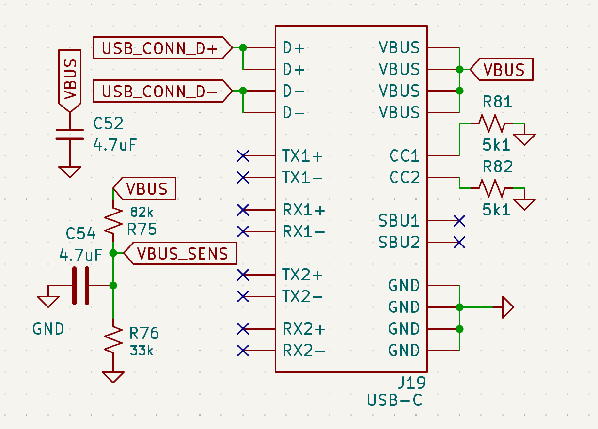
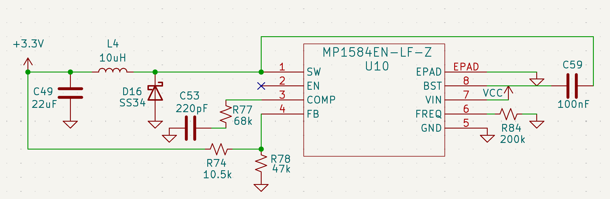
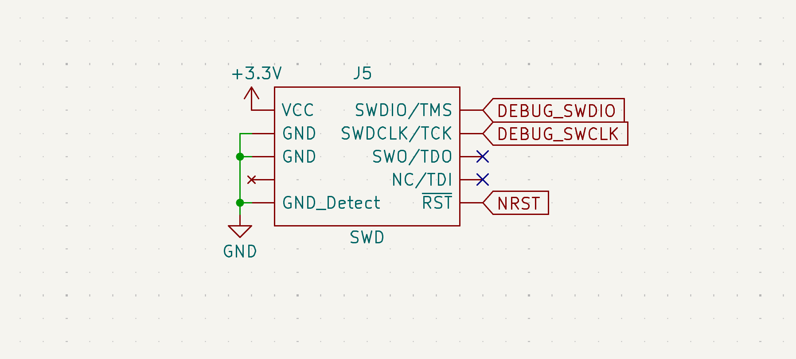

# Power Distribution & Connections

The AFS v3.0 power system is designed for high-efficiency conversion and seamless source switching to facilitate rapid ground testing and reliable flight operation.

## Power Selection
To prevent the common issue of back-feeding battery voltage into a laptop's USB port (a lesson learned from iterating on Micromouse chassis), a Schottky diode O-ring is used.

*Figure 2: Detailed O-Ring logic using SS34 Schottky barriers for reverse polarity protection.*

| Component | Function | Advantage |
| :--- | :--- | :--- |
| **SS34 (D4/D5)** | Power Arbitration | Low forward voltage drop (~0.5V) and 3A current rating. |
| **VBUS SENSE** | Logic Detection | Allows the MCU to detect when USB is connected for data offload modes. |

**Operating Principle:** The circuit automatically selects the higher potential between the Battery and USB VBUS. This removes the need for physical jumpers or switches, allowing the flight crew to plug in for debugging without power-cycling the avionics.

---
## USB Hub & Connectivity
The AFS features a high-speed USB-C interface to facilitate firmware updates and telemetry offloading. 

*Figure 3: USB-C Hub (J19) with CC1/CC2 pull-down resistors for UFP (Upstream Facing Port) negotiation.*

**Logic Review:**
* **Voltage Sensing:** A resistor divider (`R75`, `R76`) on the `VBUS_SENS` line allows the MCU to detect the presence of a USB connection without exposing the GPIO to high voltages.
* **Negotiation:** 5.1kΩ resistors (`R81`, `R82`) are used on the CC lines to correctly signal as a UFP to a USB-C Power Delivery host.

---

## ESD Control & Signal Integrity
Given the high-vibration and static-prone environment of rocket assembly and flight, the data lines are protected by a dedicated ESD suppression IC.

*Figure 4: USBLC6-2SC6 ESD protection for USB D+/D- differential pairs.*

**Design Choice:** The **USBLC6-2SC6** (U18) was selected for its ultra-low capacitance (I/O to GND ≈ 3.5pF), ensuring that the signal integrity of the high-speed USB data pairs is not compromised while providing protection against electrostatic discharges up to 15kV.

---

## Power Regulation
The core logic and sensor suite run on a stabilized 3.3V rail provided by the **MP1584** switching regulator.

### Feedback Loop Calculation
The output voltage is set via a resistor divider on the FB pin. Using the reference voltage Vref = 0.8V:

Vout = Vref × (1 + Rhigh / Rlow)

With **R74 (10.5kΩ)** and **R78 (47kΩ)**, the rail is tuned for high stability under the variable loads of the TRS radio module.

**Schematic Snippet:**

*Figure 5: MP1584 Switching Regulator circuit tuned for high-current peak handling.*

## Debugging & Programming Interface

### SWD Header (J5)

*Figure 6: Standardized SWD interface for firmware debugging and MCU programming.*

**Logic Review:** The header includes a `GND_Detect` pin and the `NRST` line, allowing for full hardware-level resets and "Connect Under Reset" debugging—essential for troubleshooting low-power sleep modes or peripheral lockups.