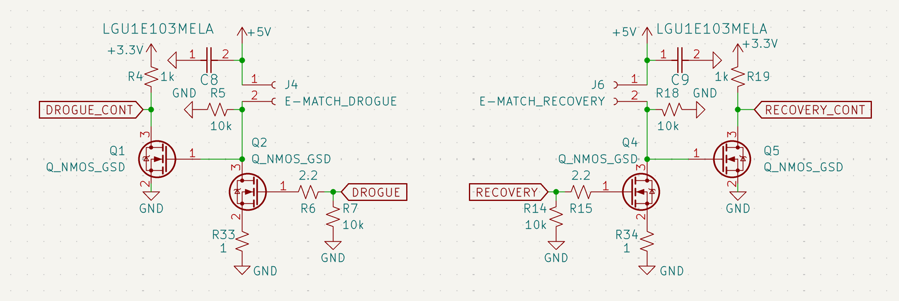

# Recovery & Parachute Ignition

Recovery is the most mission-critical aspect of the AFS. The system is designed to handle **Drogue** and **Main** deployments with full electrical isolation.

## High-Side Switching Logic
In aerospace applications, a grounded chassis can become an unintentional return path. By using high-side switching, we ensure the E-Match is only energized when explicitly commanded.

*Figure 7: Primary and Backup high-side MOSFET stages for drogue and main deployment.*

* **Primary Stage:** The `DROGUE_CONT` signal triggers the N-MOSFET gate, which pulls the P-MOSFET gate to ground.
* **Redundancy:** The board features **Recovery Backup** and **Drogue Backup** circuits. These are independent MOSFET stages that provide a secondary path to ignition in the event of a primary FET failure.

## Continuity & Fault Detection
A 1Ω shunt resistor (**R33/R34**) is placed in series with the deployment loop.

* **Pre-Flight:** The MCU can pulse the line at low duty-cycle to check for continuity without firing the pyro.
* **Post-Fire:** The system can verify if the E-Match has successfully cleared the circuit.

**Recovery Flowchart:**
[Insert System Diagram Image Here]
*Figure 8: .*

