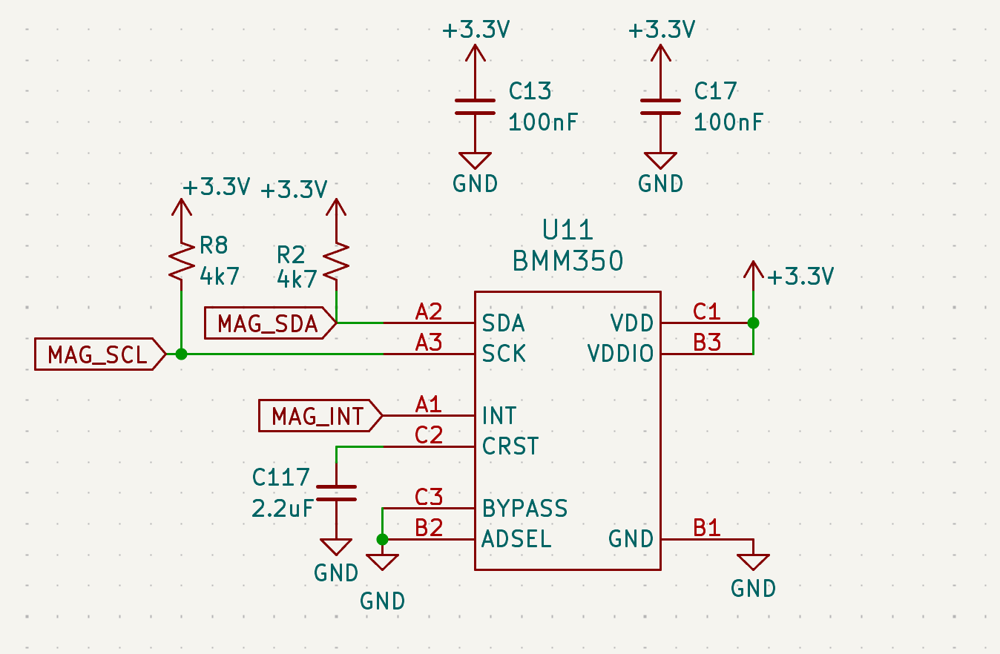
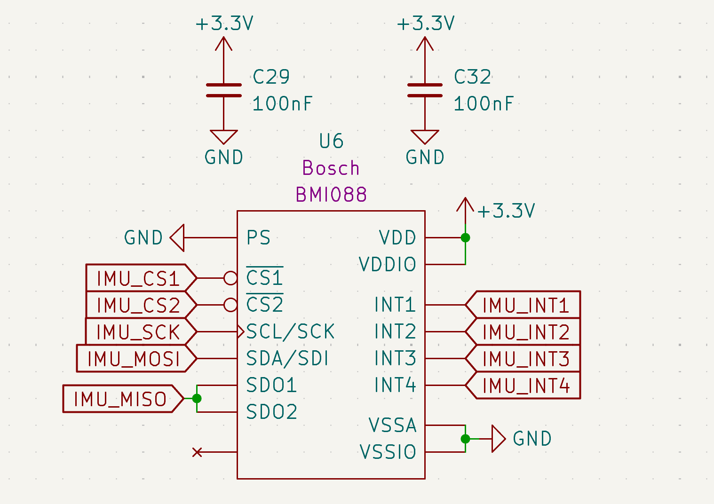
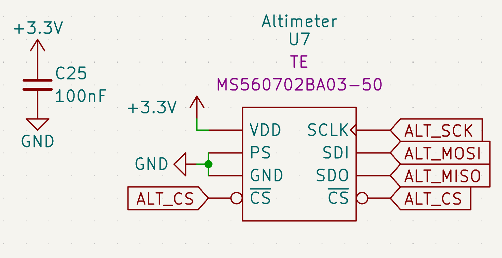
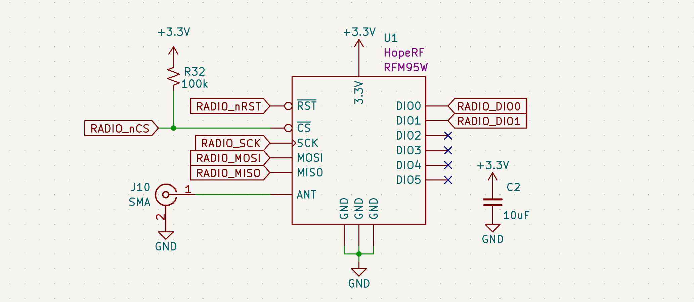
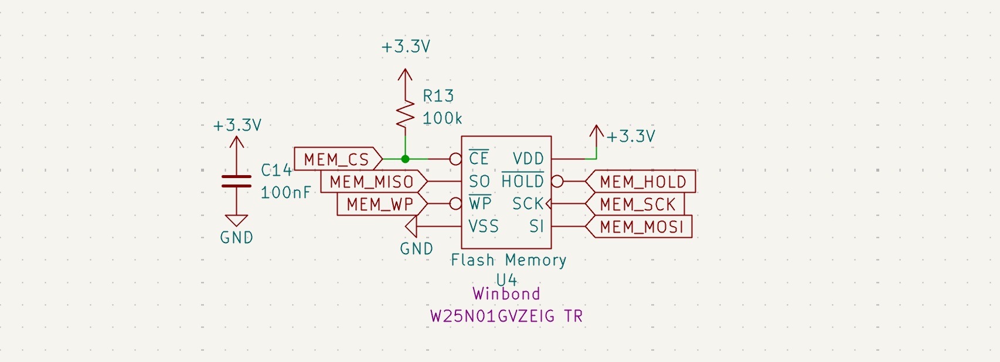
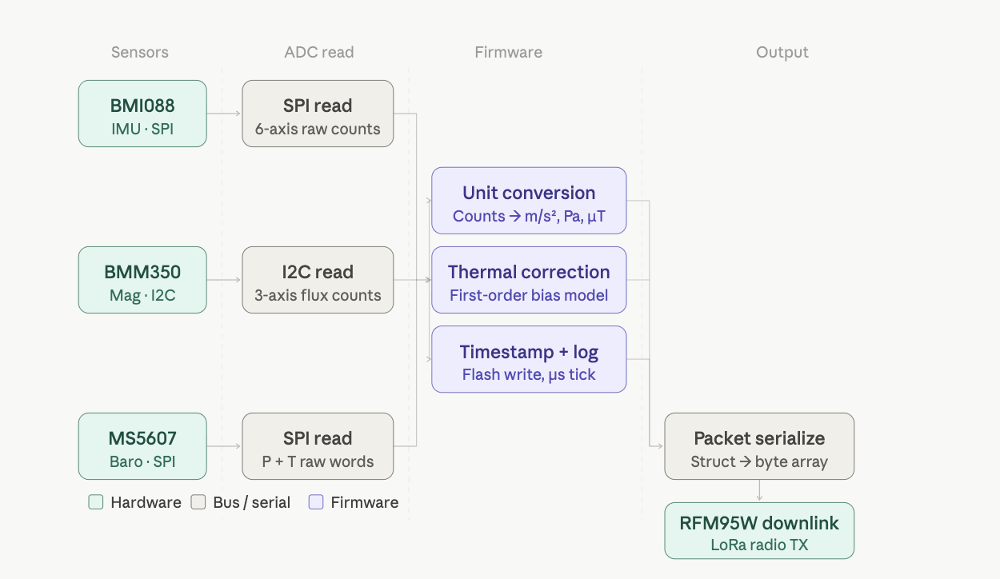

# Sensors & Calibration

The AFS v3.0 utilizes a precision sensor cluster isolated from high-noise radio and power switching zones. Since this board is designed for data collection and dynamic flight conditions, sensor integrity and thermal stability are the primary design drivers. 

** P.S: I wrote the driver code for the BMM350 Magnetometer and the 1Gb Flash Memory :P

## Sensor Architecture
The AFS features an isolated sensor bus to prevent digital noise from the TRS radio module from coupling into sensitive measurements.

| Sensor | Role | Protocol | Key Feature | Datasheet |
| :--- | :--- | :--- | :--- | :--- |
| **BMM350** | Magnetometer | I2C | TMR Technology for thermal stability | [Bosch BMM350](https://www.bosch-sensortec.com/media/boschsensortec/downloads/datasheets/bst-bmm350-ds001.pdf) |
| **BMI088** | 6-DOF IMU | SPI | Vibration Robustness | [Bosch BMI088](https://www.bosch-sensortec.com/media/boschsensortec/downloads/datasheets/bst-bmi088-ds001.pdf) |
| **MS5607** | Altimeter | SPI | High-resolution barometric sensing | [TE MS5607](https://www.te.com/commerce/DocumentDelivery/DDEController?Action=showdoc&DocId=Data+Sheet%7FMS5607-02BA03%7FB4%7Fpdf%7FEnglish%7FENG_DS_MS5607-02BA03_B4.pdf%7FMS560702BA03-50) |

## Hardware Architecture & Signal Integrity
To secure data during the high-vibration environment of a liquid-rocket launch, sensors will be grouped in a dedicated zone on the board.

* **Isolation:** The sensor bus is physically separated from the TRS radio module and high-current ignition traces to prevent EMI coupling.
* **Power Conditioning:** Each IC has localized decoupling (the 0.1μF and 1μF pairs) placed adjacent to VDD pins to suppress high-frequency ripple.
* **Bus Optimization:** 
* **I2C:** PU resistors (R-values tuned to 2.2kΩ) ensure sharp rise times at 400kHz, compensating for the trace capacitance of the 4-layer stack.
* **SPI:** The protocol select pins are pulled high to force SPI mode and enable the high data throughput necessary for real-time flight control.

---

## Individual Component Logic

### BMM350 Magnetometer (U11)

*Figure 8: BMM350 WLCSP implementation with optimized decoupling and I2C pull-ups.*

* **Design Choice:** Uses WLCSP footprint to minimize board space. 
* **Logic Review:** Includes **2.2μF bypass capacitor (C117)** on the VDDIO rail to buffer peak currents during sensing cycles.

### BMI088 6-DOF IMU (U6)

*Figure 9: BMI088 Automotive-grade IMU with dual-chip SPI interface.*

* **Design Choice:** Selected for its high grade vibration damping, critical for maintaining IMU lock during the rocket's ascent.
* **Logic Review:** To minimize digital crosstalk, the accelerometer and gyroscope operate as independent SPI devices with dedicated Chip Selects (`IMU_CS1`, `IMU_CS2`).

### MS5607-02BA03 Altimeter (U7)

*Figure 10: MS5607 Barometric pressure sensor utilizing high-speed SPI mode.*

* **Design Choice:** Chosen for its superior pressure resolution, which is vital for detecting "Apogee" (zero vertical velocity) for parachute deployment.
* **Logic Review:** Shielded from EMI via a local 100nF decoupling capacitor (**C25**).

---

### Thermal Drift Mitigation

* **TMR Stability:** Unlike usual Hall-effect sensors, the BMM350’s Tunnel Magnetoresistance tech ensures inherent stability across extreme thermal gradients present in a rocket body. 

* **Firmware Compensation:** I leverage the BMI088’s internal temperature sensor to apply a first-order thermal compensation model to the accelerometer data, correcting for bias shifts in real-time.

## Calibration & Drift Management
Environmental factors at high altitudes (up to -50°C) require active mitigation strategies to prevent navigation drift.

## Telemetry & Data Persistence

### TRS Radio Module (U1)

*Figure 12: RFM95W LoRa module for long-range telemetry downlink.*

**Logic Review:** The radio interface is handled via SPI. I've included a **100kΩ pull-up (R32)** on the Chip Select line to ensure the radio remains inactive during MCU reset, preventing bus contention.
* **RF:** The ANT pin is routed to an SMA connector (J10), so for this application the system is designed to utilize a 1/4 wave whip antenna that's tuned for the 915MHz ISM band. This ensures optimal impedance matching and maximizes the link budget for long-range data transmission!

### Flash Memory (U4)

*Figure 13: Winbond 1Gb Flash for high-reliability flight data logging.*

**Logic Review:** To ensure data integrity during high-vibration flight phases, the `WP` (Write Protect) and `HOLD` pins are tied to the 3.3V rail. A **100nF decoupling capacitor (C14)** is placed adjacent to the VCC pin to filter switching noise.

## Data Flow Diagram 

*Figure 11: Digital signal processing pipeline from raw sensor ADC values to filtered telemetry.*
